# サポートページ：CH32X035搭載XIAOピン互換ボード Support page for CH32X035 XIAO-Compatible Board #XIAO_CH32X035
WCH CH32X035を搭載した小型のマイコンボードです。
Arduino IDEからプログラム可能で、USB PDシンクとして動作できます。

Tiny microcontroller board equipped with WCH CH32X035. 
It can be programmed from the Arduino IDE and functions as a USB PD sink.  

## CH32X035搭載XIAOピン互換ボード CH32X035 XIAO-Compatible Board
WCH CH32X035搭載のUSB PD対応マイコンボードです。  
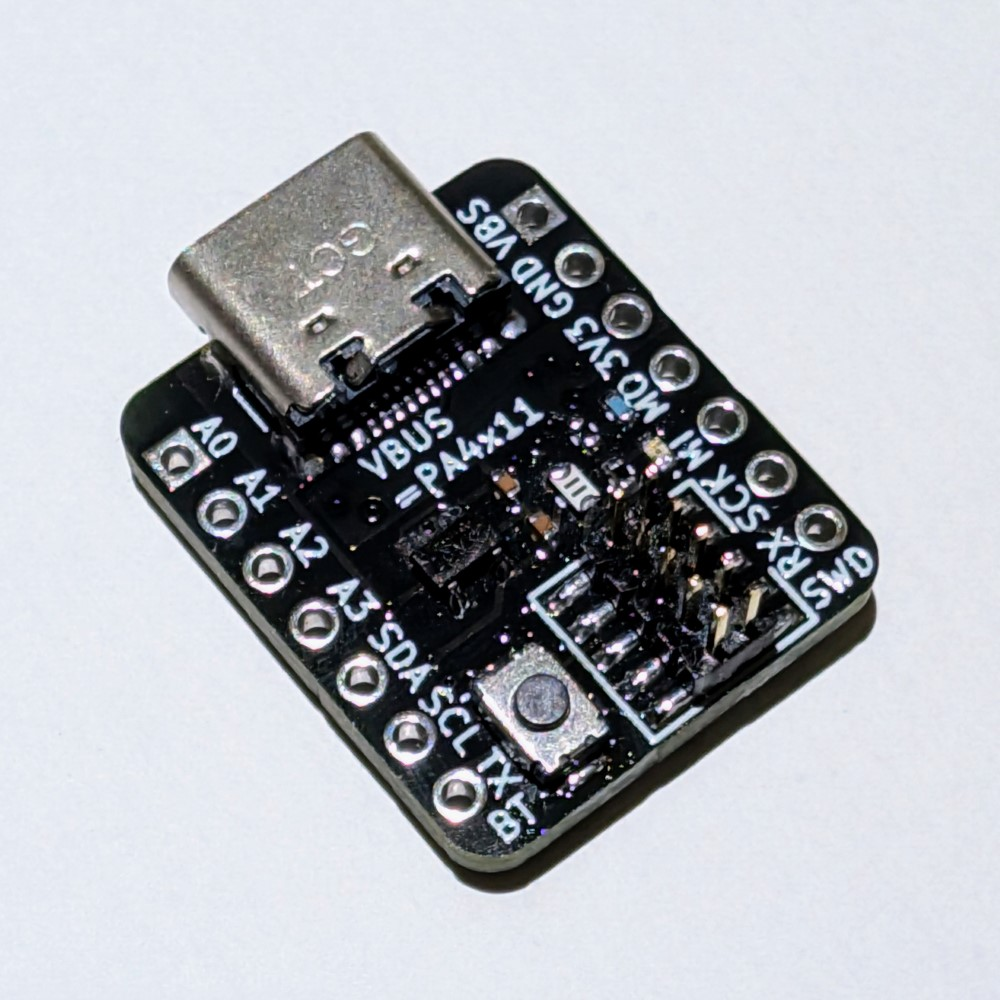  
  
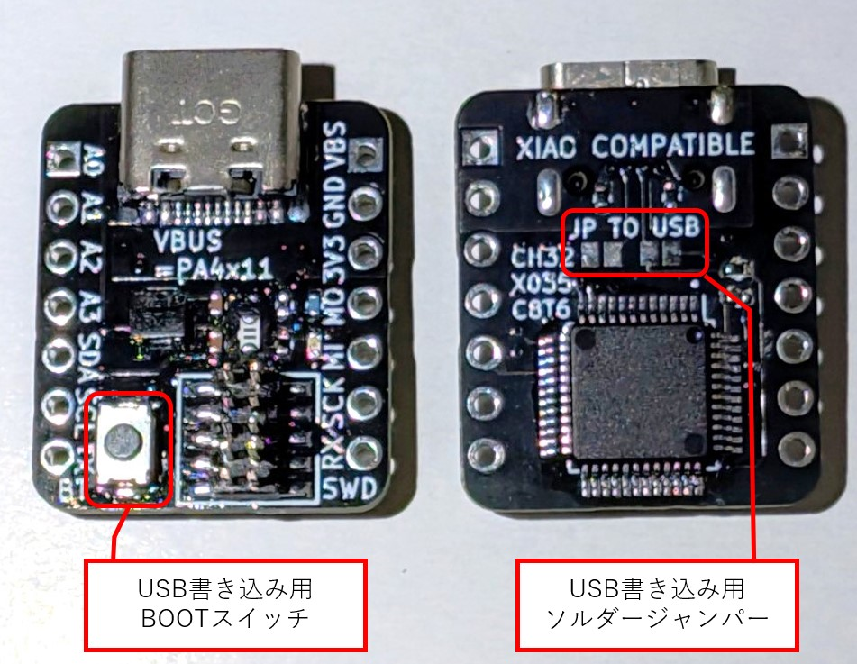  
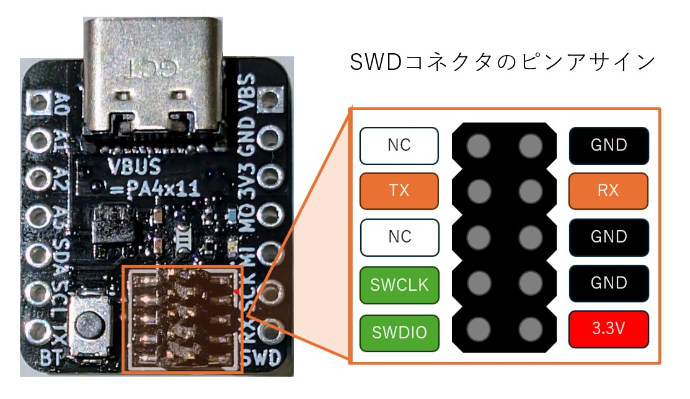  
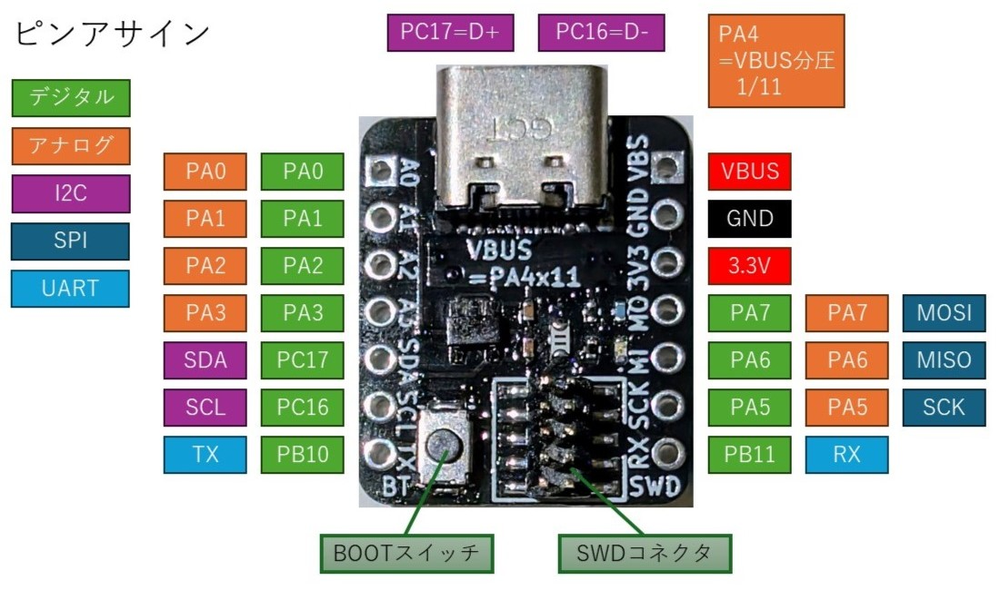  
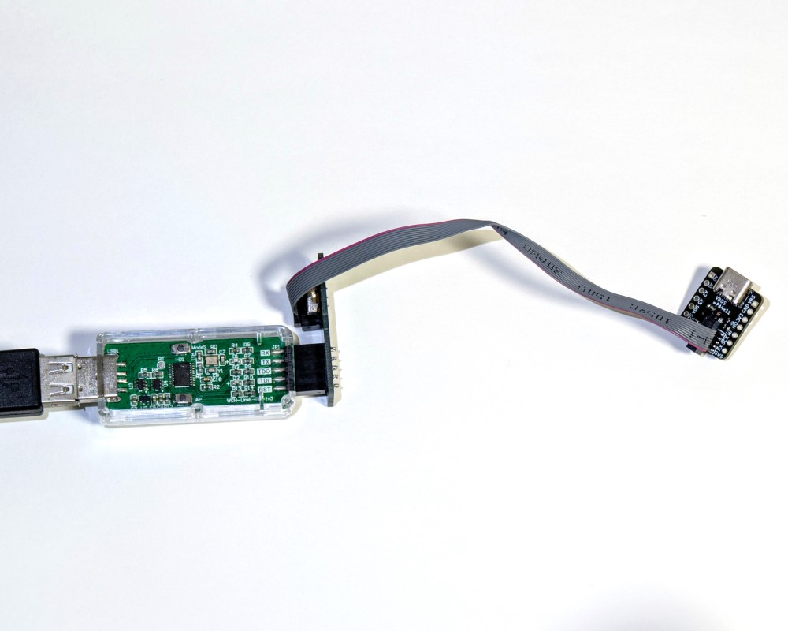  
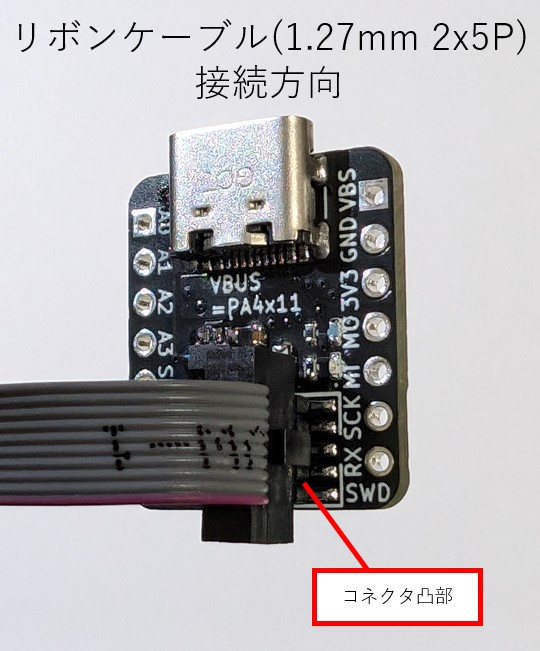  
  
[回路図PDF](hardware/CH32X035_XIAO-Compatible_Board/CH32X035_XIAO-Compatible_Board.pdf)  
[回路図をブラウザで見る](https://kicanvas.org/?github=https%3A%2F%2Fgithub.com%2Fsuzan-works%2FXIAO_CH32X035%2Fblob%2Fmain%2Fhardware%2FCH32X035_XIAO-Compatible_Board%2FCH32X035_XIAO-Compatible_Board.kicad_sch)  
[基板データをブラウザで見る](https://kicanvas.org/?github=https%3A%2F%2Fgithub.com%2Fsuzan-works%2FXIAO_CH32X035%2Fblob%2Fmain%2Fhardware%2FCH32X035_XIAO-Compatible_Board%2FCH32X035_XIAO-Compatible_Board.kicad_pcb)  
  
## SWD変換基板 SWD Converter Board
デバッガWCH-LinkEとマイコンボード上のコネクタ(1.27mm 10P)を接続するための変換基板です。  
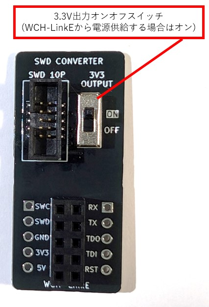  
  
[回路図PDF](hardware/SWD_Converter_Board/SWD_Converter_Board.pdf)  
[回路図をブラウザで見る](https://kicanvas.org/?github=https%3A%2F%2Fgithub.com%2Fsuzan-works%2FXIAO_CH32X035%2Fblob%2Fmain%2Fhardware%2FSWD_Converter_Board%2FSWD_Converter_Board.kicad_sch)  
[基板データをブラウザで見る](https://kicanvas.org/?github=https%3A%2F%2Fgithub.com%2Fsuzan-works%2FXIAO_CH32X035%2Fblob%2Fmain%2Fhardware%2FSWD_Converter_Board%2FSWD_Converter_Board.kicad_pcb)  
  
## VBUSスイッチアドオンボード VBUS Switch Add-on Board
マイコンボードからVBUS出力のオンオフを切り替えられるアドオンボードです。
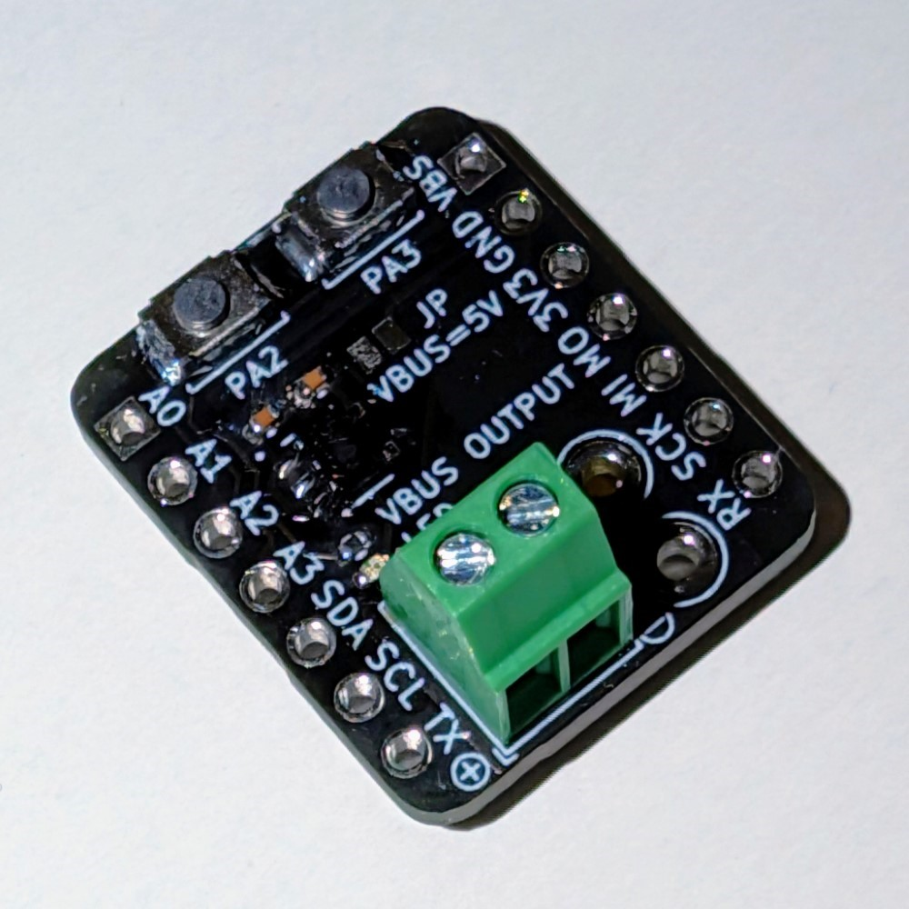  
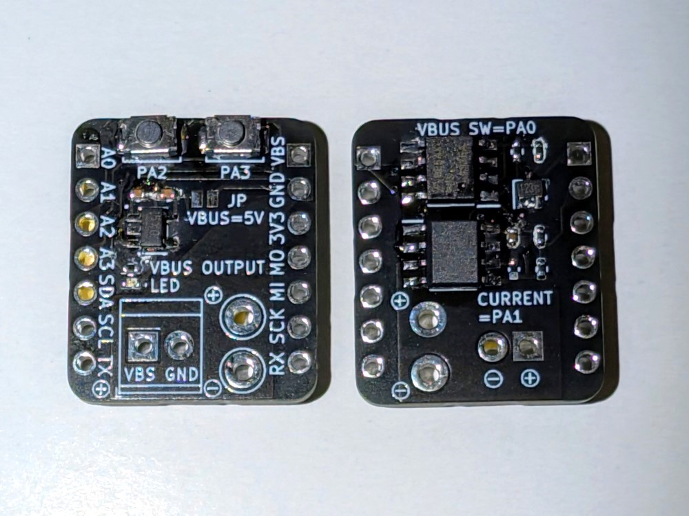  
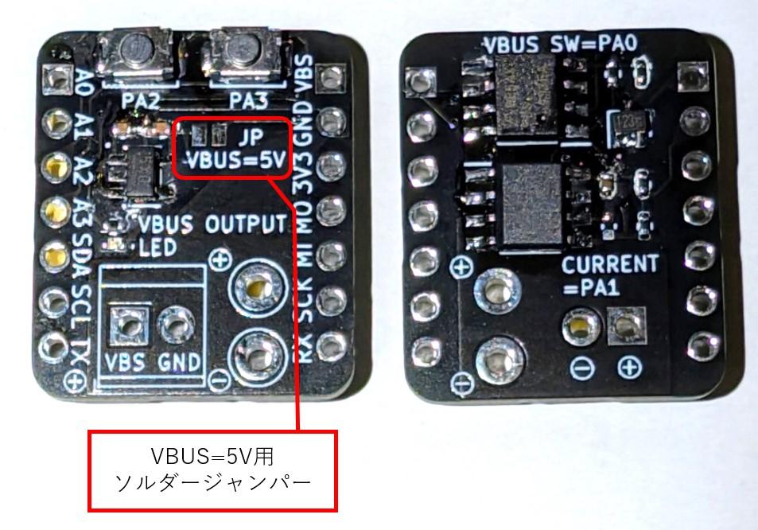  
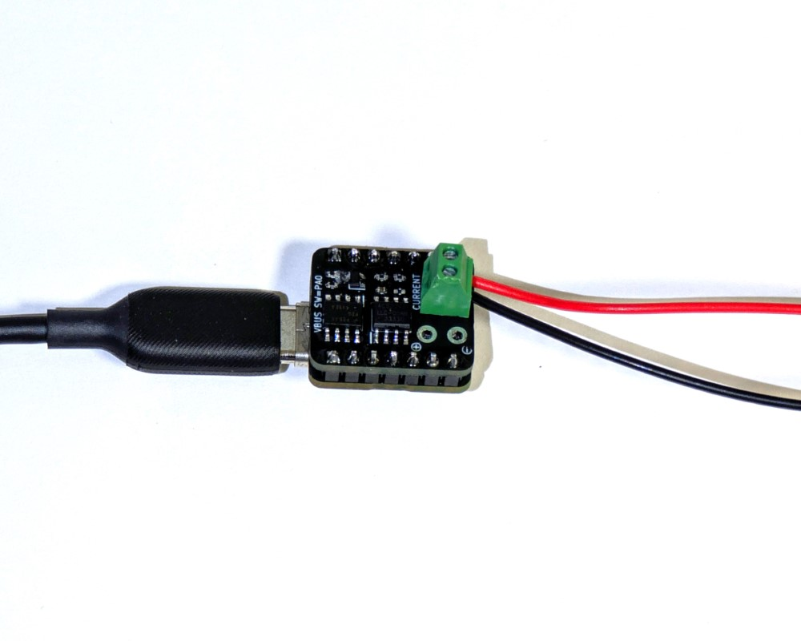  
  
[回路図PDF](hardware/VBUS_Switch_Addon_Board/VBUS_Switch_Addon_Board.pdf)  
[回路図をブラウザで見る](https://kicanvas.org/?github=https%3A%2F%2Fgithub.com%2Fsuzan-works%2FXIAO_CH32X035%2Fblob%2Fmain%2Fhardware%2FVBUS_Switch_Addon_Board%2FVBUS_Switch_Addon_Board.kicad_sch)  
[基板データをブラウザで見る](https://kicanvas.org/?github=https%3A%2F%2Fgithub.com%2Fsuzan-works%2FXIAO_CH32X035%2Fblob%2Fmain%2Fhardware%2FVBUS_Switch_Addon_Board%2FVBUS_Switch_Addon_Board.kicad_pcb)  
  
## 導入手順
### Arduino IDE
WCH arduino_core_ch32をインストールすることで、Arduino IDEで開発ができます。  
https://github.com/openwch/arduino_core_ch32  
ボード設定でCH32X035を選択してください。
### 初期ファームウェア
[PreInstalledFirmware.ino](software/examples/PreInstalledFirmware/PreInstalledFirmware.ino) : 5秒ごとにUSB PDの電圧を切り替えます。テスター等でVBUS-GND間の電圧をご確認ください。
