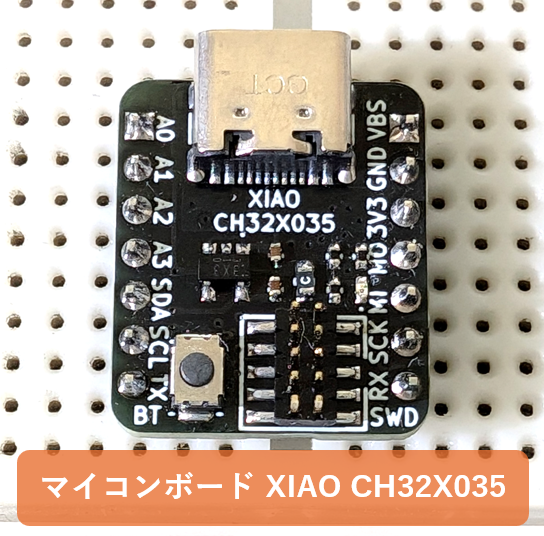
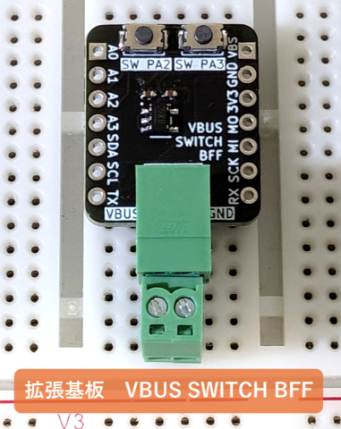
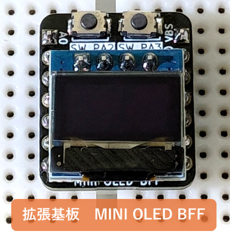

# XIAO_CH32X035 Project
WCH CH32X035を搭載した小型のマイコンボードです。
Arduino IDEからプログラム可能で、USB PDシンクとして動作できます。

Tiny microcontroller board equipped with WCH CH32X035. 
It can be programmed from the Arduino IDE and functions as a USB PD sink.
## 紹介動画 Introduction on YouTube
[](https://www.youtube.com/watch?v=rt-zcZJ9Ph8)

## Hardware
### XIAO_CH32X035
  
マイコンボード本体  
[回路図PDF](./hardware/XIAO_CH32X035/XIAO_CH32X035_schematic.pdf)  
[回路図データをブラウザで見る](https://kicanvas.org/?github=https%3A%2F%2Fgithub.com%2Fsuzan-works%2FXIAO_CH32X035%2Fblob%2Fmain%2Fhardware%2FXIAO_CH32X035%2FXIAO_CH32X035.kicad_sch)  
[基板CADデータをブラウザで見る](https://kicanvas.org/?github=https%3A%2F%2Fgithub.com%2Fsuzan-works%2FXIAO_CH32X035%2Fblob%2Fmain%2Fhardware%2FXIAO_CH32X035%2FXIAO_CH32X035.kicad_pcb)  
  
### WCH-LinkE_adapter
  
WCH-LinkEをSWDコネクタ(1.27mm 10P)に変換する基板  
[回路図PDF](./hardware/WCH-LinkE_adapter/WCH-LinkE_adapter_schematic.pdf)  
[回路図データをブラウザで見る](https://kicanvas.org/?github=https%3A%2F%2Fgithub.com%2Fsuzan-works%2FXIAO_CH32X035%2Fblob%2Fmain%2Fhardware%2FWCH-LinkE_adapter%2FWCH-LinkE_adapter.kicad_sch)  
[基板CADデータをブラウザで見る](https://kicanvas.org/?github=https%3A%2F%2Fgithub.com%2Fsuzan-works%2FXIAO_CH32X035%2Fblob%2Fmain%2Fhardware%2FWCH-LinkE_adapter%2FWCH-LinkE_adapter.kicad_pcb)  
  
### VBUS_SWITCH_BFF
  
MOSFETでVBUS出力をオンオフする拡張基板  
[回路図PDF](./hardware/VBUS_SWITCH_BFF/VBUS_SWITCH_BFF_schematic.pdf)  
[回路図データをブラウザで見る](https://kicanvas.org/?github=https%3A%2F%2Fgithub.com%2Fsuzan-works%2FXIAO_CH32X035%2Fblob%2Fmain%2Fhardware%2FVBUS_SWITCH_BFF%2FVBUS_SWITCH_BFF.kicad_sch)  
[基板CADデータをブラウザで見る](https://kicanvas.org/?github=https%3A%2F%2Fgithub.com%2Fsuzan-works%2FXIAO_CH32X035%2Fblob%2Fmain%2Fhardware%2FVBUS_SWITCH_BFF%2FVBUS_SWITCH_BFF.kicad_pcb)  
  
### MINI_OLED_BFF
  
小型OLEDディスプレイ搭載の拡張基板   
[回路図PDF](./hardware/MINI_OLED_BFF/MINI_OLED_BFF_schematic.pdf)  
[回路図データをブラウザで見る](https://kicanvas.org/?github=https%3A%2F%2Fgithub.com%2Fsuzan-works%2FXIAO_CH32X035%2Fblob%2Fmain%2Fhardware%2FMINI_OLED_BFF%2FMINI_OLED_BFF.kicad_sch)  
[基板CADデータをブラウザで見る](https://kicanvas.org/?github=https%3A%2F%2Fgithub.com%2Fsuzan-works%2FXIAO_CH32X035%2Fblob%2Fmain%2Fhardware%2FMINI_OLED_BFF%2FMINI_OLED_BFF.kicad_pcb)  

## Software
### 使用例 Examples
- [Simple USB PD Sink](./software/examples/SimpleUSBPDSink/SimpleUSBPDSink.ino)  
USB PD ソース(USB PD充電器)に20Vを要求する、最もシンプルなコードです。
- [Variable Voltage Heater Control](./software/examples/VariableVoltageHeaterControl/VariableVoltageHeaterControl.ino)  
VBUSでヒータを加熱して、その温度に応じて電圧を変化させてVBUS出力をオンオフするシステムです。
### 導入の注意点 Setup Notes
- [Arduino core support for CH32 EVT Boards](https://github.com/openwch/arduino_core_ch32) を使って、[Arduino IDE](https://www.arduino.cc/en/software)からファームウェアを書き換えます。
- [v1.0.4](https://github.com/openwch/arduino_core_ch32/releases/tag/1.0.4)では、CH32X035のI2C通信はサポートされていないため、以下のボード設定ファイルを書き換える必要があります。[コミット"adding hardwaret timer and fixing PWM pins errors (#71)"](https://github.com/openwch/arduino_core_ch32/commit/c40c5c8095060c523e635b99426314fab56fe12c)にて実装済みの内容なので、今後のボードのアップデート以降は、以下の対応は不要の見込みです。  
  [*v1.0.4の"variant_CH32X035G8U.h"*](https://github.com/openwch/arduino_core_ch32/blob/f14a216b441e03907d2c0c9afab03e3985ab6852/variants/CH32X035/CH32X035G8U/variant_CH32X035G8U.h)  
  ```
  /* ENABLE Peripherals */  
  #define                         ADC_MODULE_ENABLED  
  #define                         UART_MODULE_ENABLED  
  #define                         SPI_MODULE_ENABLED  
  // #define                         I2C_MODULE_ENABLED  
  ```
  
  *変更後の"variant_CH32X035G8U.h"*  
   ```  
  /* ENABLE Peripherals */  
  #define                         ADC_MODULE_ENABLED  
  #define                         UART_MODULE_ENABLED  
  #define                         SPI_MODULE_ENABLED  
  #define                         I2C_MODULE_ENABLED  
  ```  
- ボード設定ではCH32X035G8U6 (QFN28)ですが、本プロジェクトではCH32X035C8T6 (LQFP48)を使っています。CH32X035G8U6には、I2C通信ができないロットがあるためです。詳細は[データシート](https://www.wch-ic.com/downloads/CH32X035DS0_PDF.html)をご確認ください。  
